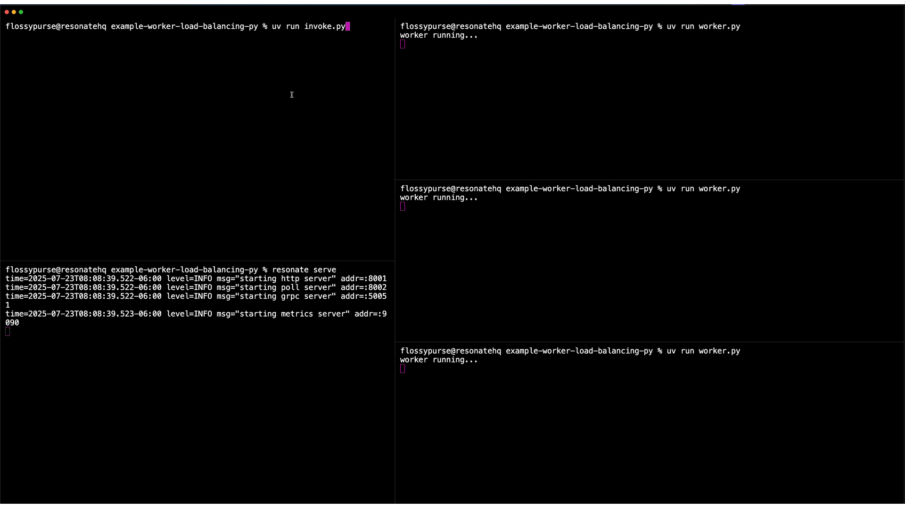

# Worker load balancing


**Resonate Python SDK**

This example showcases Resonate's automatic service discovery and load balancing capabilities.

Instructions on [How to run this example](#how-to-run-this-example) are below.



## The problem

A single worker or microservice instance will eventually become overwhelmed if there is too much work sent its way in a short amount of time.

There are generally two ways to solve for this:

1. Increase the compute capability for the single worker / microservice.
2. Increase the number of worker / microservice instances.

There is an upper limit to the first option, and it is a single point of failure if there is only ever one instance running.

Therefore, the second option tends to be the desired approach, because in theory you can scale the number of instances indefinitely. However, this introduces another problem: service discovery and load balancing — that is, knowing which worker / application node has the capacity to take more work.

But not just that, what happens if a worker / microservice instance crashes after starting claiming work and starting to make progress it.

How does the system know it needs to recover that work somewhere else, and where to recover it?

These are distributed system engineering issues that developers are commonly forced to solve again and again.
And often they are forced to mix messy service discovery, load balancing, and recovery logic in with their application/business level logic, which makes for a very poor developer experience.

## The solution

Resonate has built-in service discovery, load balancing, and recovery. And it provides the developer with a simple RPC API and target schema to make use of these features.

In your worker / microservice you can just specify the group that it belongs to:

```python
from resonate import Resonate

resonate = Resonate.remote(
    group="worker-group"
    # ...
)
```

Run as many instances of that worker / microservice that you need.

Then, when you need to call a function on that worker / microservice you use Resonate's RPC API, targeting any worker in that group.

```python
result = resonate.options(target="poll://any@worker-group").rpc(promise_id, "function_name", params)
```

Resonate handles the rest!

You get automatic service discovery, load balancing, and recovery for all the workers in that group.

## About this example

This example demonstrates Resonate's built-in load balancing and recovery capabilities.

As the operator, you will run multiple instances of a worker (`worker.py`).
The worker contains a single function `compute_something()`.

You will then use the invoke script (`invoke.py`) to start many `compute_somthing()` executions.

As you invoke more and more executions, you will see them start to spread across the multiple instances of workers.

If you kill one of the workers while it is in the middle of handling executions, you will see the executions recover on another worker.

As a developer, if you look at the code on the worker, you will notice that it identifies itself as a member of the `worker_group`.

And if you look at the code on the invoke script, you will notice that the invocation of `compute_something()` targets any worker in the `worker_group`.

This example is meant to show that with minimal developer and operator overhead, you get load balancing and recovery out-of-the-box with Resonate.

## How to run this example

This example requires that a Resonate Server is running.
The Resonate Server acts as a Durable Promise store and a message broker.

Run the Resonate Server:

```shell
# install the server if you haven't yet
brew install resonatehq/tap/resonate
# start the server
resonate serve
```

Run multiple worker instances.
We recommend running at least 3 instances to get the best demonstration.

```shell
uv run worker.py
```

Run the invoke script.
The invoke script does not block on a result from `compute_something()`, so you can run it back to back, as many times as needed.
We recommend running it at least a dozen times to get the best demonstration.

```shell
uv run invoke.py
```
